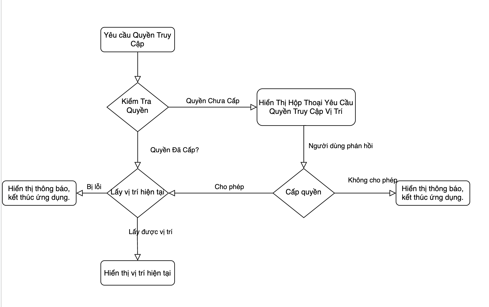

# AndroidLocationPermission
- This project is the sample for request location permission.

## Tổng quan:
- Quyền về location có 2 loại quyền:
  - `ACCESS_FINE_LOCATION`: Quyền này cho phép ứng dụng truy cập vào vị trí chính xác của người dùng, bao gồm thông tin từ GPS. Khi sử dụng quyền này, ứng dụng có thể lấy vị trí của người dùng với độ chính xác cao nhất có thể.
  - `ACCESS_COARSE_LOCATION`: Quyền này cho phép ứng dụng truy cập vào vị trí xấp xỉ của người dùng. Thông thường, nó sử dụng thông tin về mạng di động hoặc Wi-Fi để xác định vị trí của thiết bị. Quyền này cung cấp vị trí với độ chính xác thấp hơn so với `ACCESS_FINE_LOCATION` nhưng vẫn đủ để cung cấp các dịch vụ dựa trên vị trí như xác định thành phố hoặc khu vực hiện tại.
  - Lưu ý: trong file manifest nếu yêu cầu quyền `ACCESS_FINE_LOCATION` thì cũng bắt buộc phải có quyền `ACCESS_COARSE_LOCATION`

## Yếu tố ảnh hưởng đến sự thay đổi quyền:
1. Cập nhật phiên bản ứng dụng
2. Thay đổi cấu hình trong Android Manifest
3. Nâng cấp hệ điều hành Android
4. Chính sách an ninh hoặc quản lý thiết bị
5. Tương tác người dùng

## Một số yếu tố có thể ảnh hưởng đến quyền truy cập location bị tắt:
1. Người dùng từ chối quyền: khi cài đặt, người dùng chọn tắt.
2. Người dùng thu hồi quyền: Người dùng có thể vào mục thông tin của ứng dụng, sau đó tắt quyền.
3. Cập nhật phần mềm.
4. Chế độ tiết kiệm pin hoặc chế độ hạn chế dữ liệu.
5. Thay đổi cấu hình hệ thống: Một số thiết lập hệ thống có thể ảnh hưởng đến quyền của ứng dụng. Ví dụ, người dùng có thể tắt GPS hoặc tắt quyền truy cập dữ liệu di động, làm ảnh hưởng đến khả năng của ứng dụng lấy vị trí hoặc truy cập Internet.
6. Các chính sách an ninh hoặc quản lý thiết bị.

## Ứng dụng demo để truy cập vị trí hiện tại của người dùng:

### Yêu cầu quyền:

1. thêm yêu cầu quyền vào file ` AndroidManifest.xml`

```xml
<manifest xmlns:android="http://schemas.android.com/apk/res/android"
    package="com.example.myapp">
    
    <uses-permission android:name="android.permission.ACCESS_FINE_LOCATION" />
    <uses-permission android:name="android.permission.ACCESS_COARSE_LOCATION" />

    <application ...>
        ...
    </application>
</manifest>

```

2. Yêu cầu quyền tại runtime:

```Kotlin
if (checkSelfPermission(Manifest.permission.ACCESS_FINE_LOCATION) == PackageManager.PERMISSION_GRANTED) {
            val location = locationManager.getLastKnownLocation(LocationManager.GPS_PROVIDER)
            // Get the current position from the location.
            
        } else {
            // Request the permission. ACCESS_COARSE_LOCATION | ACCESS_FINE_LOCATION
            requestPermissionLauncher.launch(Manifest.permission.ACCESS_FINE_LOCATION)
        }
```

3. Flow:



4. Demo:

<video controls width="500">
    <source src="./images/demo.mp4" type="video/mp4">
    Your browser does not support the video tag.
</video>

